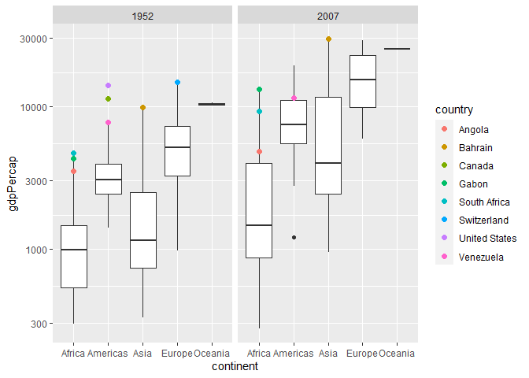
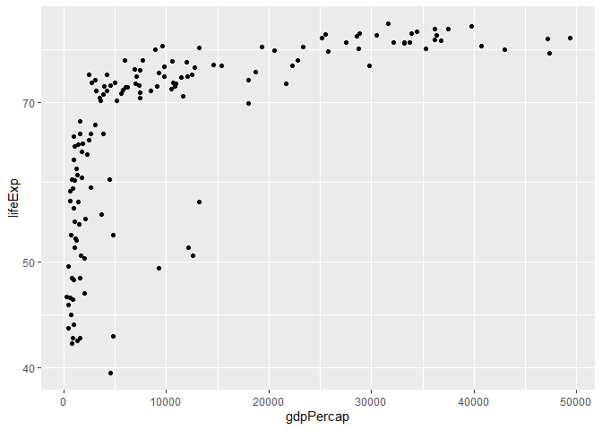
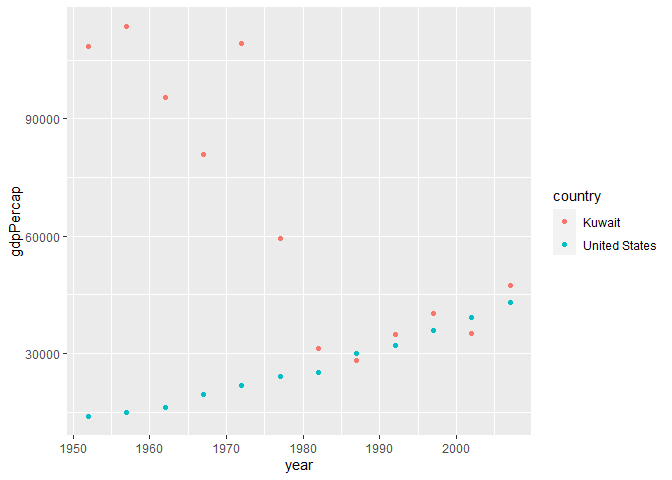
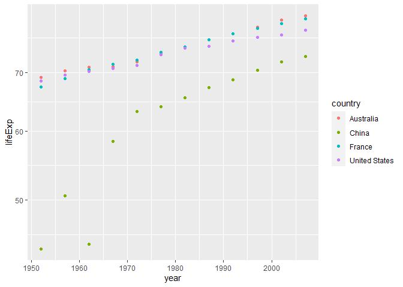

Gapminder
================
(Your name here)
2020-

- <a href="#grading-rubric" id="toc-grading-rubric">Grading Rubric</a>
  - <a href="#individual" id="toc-individual">Individual</a>
  - <a href="#due-date" id="toc-due-date">Due Date</a>
- <a href="#guided-eda" id="toc-guided-eda">Guided EDA</a>
  - <a
    href="#q0-perform-your-first-checks-on-the-dataset-what-variables-are-in-this"
    id="toc-q0-perform-your-first-checks-on-the-dataset-what-variables-are-in-this"><strong>q0</strong>
    Perform your “first checks” on the dataset. What variables are in
    this</a>
  - <a
    href="#q1-determine-the-most-and-least-recent-years-in-the-gapminder-dataset"
    id="toc-q1-determine-the-most-and-least-recent-years-in-the-gapminder-dataset"><strong>q1</strong>
    Determine the most and least recent years in the <code>gapminder</code>
    dataset.</a>
  - <a
    href="#q2-filter-on-years-matching-year_min-and-make-a-plot-of-the-gdp-per-capita-against-continent-choose-an-appropriate-geom_-to-visualize-the-data-what-observations-can-you-make"
    id="toc-q2-filter-on-years-matching-year_min-and-make-a-plot-of-the-gdp-per-capita-against-continent-choose-an-appropriate-geom_-to-visualize-the-data-what-observations-can-you-make"><strong>q2</strong>
    Filter on years matching <code>year_min</code>, and make a plot of the
    GDP per capita against continent. Choose an appropriate
    <code>geom_</code> to visualize the data. What observations can you
    make?</a>
  - <a
    href="#q3-you-should-have-found-at-least-three-outliers-in-q2-but-possibly-many-more-identify-those-outliers-figure-out-which-countries-they-are"
    id="toc-q3-you-should-have-found-at-least-three-outliers-in-q2-but-possibly-many-more-identify-those-outliers-figure-out-which-countries-they-are"><strong>q3</strong>
    You should have found <em>at least</em> three outliers in q2 (but
    possibly many more!). Identify those outliers (figure out which
    countries they are).</a>
  - <a
    href="#q4-create-a-plot-similar-to-yours-from-q2-studying-both-year_min-and-year_max-find-a-way-to-highlight-the-outliers-from-q3-on-your-plot-in-a-way-that-lets-you-identify-which-country-is-which-compare-the-patterns-between-year_min-and-year_max"
    id="toc-q4-create-a-plot-similar-to-yours-from-q2-studying-both-year_min-and-year_max-find-a-way-to-highlight-the-outliers-from-q3-on-your-plot-in-a-way-that-lets-you-identify-which-country-is-which-compare-the-patterns-between-year_min-and-year_max"><strong>q4</strong>
    Create a plot similar to yours from q2 studying both
    <code>year_min</code> and <code>year_max</code>. Find a way to highlight
    the outliers from q3 on your plot <em>in a way that lets you identify
    which country is which</em>. Compare the patterns between
    <code>year_min</code> and <code>year_max</code>.</a>
- <a href="#your-own-eda" id="toc-your-own-eda">Your Own EDA</a>
  - <a
    href="#q5-create-at-least-three-new-figures-below-with-each-figure-try-to-pose-new-questions-about-the-data"
    id="toc-q5-create-at-least-three-new-figures-below-with-each-figure-try-to-pose-new-questions-about-the-data"><strong>q5</strong>
    Create <em>at least</em> three new figures below. With each figure, try
    to pose new questions about the data.</a>

*Purpose*: Learning to do EDA well takes practice! In this challenge
you’ll further practice EDA by first completing a guided exploration,
then by conducting your own investigation. This challenge will also give
you a chance to use the wide variety of visual tools we’ve been
learning.

<!-- include-rubric -->

# Grading Rubric

<!-- -------------------------------------------------- -->

Unlike exercises, **challenges will be graded**. The following rubrics
define how you will be graded, both on an individual and team basis.

## Individual

<!-- ------------------------- -->

| Category    | Needs Improvement                                                                                                | Satisfactory                                                                                                               |
|-------------|------------------------------------------------------------------------------------------------------------------|----------------------------------------------------------------------------------------------------------------------------|
| Effort      | Some task **q**’s left unattempted                                                                               | All task **q**’s attempted                                                                                                 |
| Observed    | Did not document observations, or observations incorrect                                                         | Documented correct observations based on analysis                                                                          |
| Supported   | Some observations not clearly supported by analysis                                                              | All observations clearly supported by analysis (table, graph, etc.)                                                        |
| Assessed    | Observations include claims not supported by the data, or reflect a level of certainty not warranted by the data | Observations are appropriately qualified by the quality & relevance of the data and (in)conclusiveness of the support      |
| Specified   | Uses the phrase “more data are necessary” without clarification                                                  | Any statement that “more data are necessary” specifies which *specific* data are needed to answer what *specific* question |
| Code Styled | Violations of the [style guide](https://style.tidyverse.org/) hinder readability                                 | Code sufficiently close to the [style guide](https://style.tidyverse.org/)                                                 |

## Due Date

<!-- ------------------------- -->

All the deliverables stated in the rubrics above are due **at midnight**
before the day of the class discussion of the challenge. See the
[Syllabus](https://docs.google.com/document/d/1qeP6DUS8Djq_A0HMllMqsSqX3a9dbcx1/edit?usp=sharing&ouid=110386251748498665069&rtpof=true&sd=true)
for more information.

``` r
library(tidyverse)
```

    ## ── Attaching packages ─────────────────────────────────────── tidyverse 1.3.2 ──
    ## ✔ ggplot2 3.4.0      ✔ purrr   1.0.1 
    ## ✔ tibble  3.1.8      ✔ dplyr   1.0.10
    ## ✔ tidyr   1.2.1      ✔ stringr 1.5.0 
    ## ✔ readr   2.1.3      ✔ forcats 0.5.2 
    ## ── Conflicts ────────────────────────────────────────── tidyverse_conflicts() ──
    ## ✖ dplyr::filter() masks stats::filter()
    ## ✖ dplyr::lag()    masks stats::lag()

``` r
library(gapminder)
```

*Background*: [Gapminder](https://www.gapminder.org/about-gapminder/) is
an independent organization that seeks to educate people about the state
of the world. They seek to counteract the worldview constructed by a
hype-driven media cycle, and promote a “fact-based worldview” by
focusing on data. The dataset we’ll study in this challenge is from
Gapminder.

# Guided EDA

<!-- -------------------------------------------------- -->

First, we’ll go through a round of *guided EDA*. Try to pay attention to
the high-level process we’re going through—after this guided round
you’ll be responsible for doing another cycle of EDA on your own!

### **q0** Perform your “first checks” on the dataset. What variables are in this

dataset?

``` r
help(gapminder)
```

    ## starting httpd help server ... done

``` r
glimpse(gapminder)
```

    ## Rows: 1,704
    ## Columns: 6
    ## $ country   <fct> "Afghanistan", "Afghanistan", "Afghanistan", "Afghanistan", …
    ## $ continent <fct> Asia, Asia, Asia, Asia, Asia, Asia, Asia, Asia, Asia, Asia, …
    ## $ year      <int> 1952, 1957, 1962, 1967, 1972, 1977, 1982, 1987, 1992, 1997, …
    ## $ lifeExp   <dbl> 28.801, 30.332, 31.997, 34.020, 36.088, 38.438, 39.854, 40.8…
    ## $ pop       <int> 8425333, 9240934, 10267083, 11537966, 13079460, 14880372, 12…
    ## $ gdpPercap <dbl> 779.4453, 820.8530, 853.1007, 836.1971, 739.9811, 786.1134, …

**Observations**:

The variables in this data set are: country, continent, year (1952 -
2007 in 5 year increments), life expectancy (in years), population, GDP
per capita (USD, adjusted for inflation)

### **q1** Determine the most and least recent years in the `gapminder` dataset.

*Hint*: Use the `pull()` function to get a vector out of a tibble.
(Rather than the `$` notation of base R.)

``` r
## TASK: Find the largest and smallest values of `year` in `gapminder`
years_list <-
  gapminder %>% 
  group_by(year) %>% 
  pull(year)

year_max <-
  max(years_list)
year_min <-
  min(years_list)
```

Use the following test to check your work.

``` r
## NOTE: No need to change this
assertthat::assert_that(year_max %% 7 == 5)
```

    ## [1] TRUE

``` r
assertthat::assert_that(year_max %% 3 == 0)
```

    ## [1] TRUE

``` r
assertthat::assert_that(year_min %% 7 == 6)
```

    ## [1] TRUE

``` r
assertthat::assert_that(year_min %% 3 == 2)
```

    ## [1] TRUE

``` r
if (is_tibble(year_max)) {
  print("year_max is a tibble; try using `pull()` to get a vector")
  assertthat::assert_that(False)
}

print("Nice!")
```

    ## [1] "Nice!"

### **q2** Filter on years matching `year_min`, and make a plot of the GDP per capita against continent. Choose an appropriate `geom_` to visualize the data. What observations can you make?

You may encounter difficulties in visualizing these data; if so document
your challenges and attempt to produce the most informative visual you
can.

``` r
gapminder %>% 
  filter(year == year_min) %>% 
  ggplot +
  geom_boxplot(mapping = aes(x = continent, y = gdpPercap)) +
  scale_y_log10()
```

<!-- -->

**Observations**:

It’s difficult to read this chart, because the scaling on the graph is
messed up by the outlier with an over 90000 gdp per capita. However, I
can still see that Oceania has the highest overall gdp, whole Africa and
Asia are on the lower end. There are also many outliers represented on
the graph as points. Africa has a few, Americas have 3, Asia has 2, and
Europe has 1.

**Difficulties & Approaches**:

It’s difficult to read this chart, because the scaling on the graph is
messed up by the outlier with an over 90000 gdp per capita. I attempted
to look through the reading on box plots in order to figure out how to
fix the scaling, however I wasn’t able to figure it out.

### **q3** You should have found *at least* three outliers in q2 (but possibly many more!). Identify those outliers (figure out which countries they are).

``` r
gapminder %>% 
  filter(year == year_min) %>% 
  group_by(continent) %>% 
  filter(gdpPercap >= quantile(gdpPercap, 0.75) + 1.5*IQR(gdpPercap))
```

    ## # A tibble: 9 × 6
    ## # Groups:   continent [4]
    ##   country       continent  year lifeExp       pop gdpPercap
    ##   <fct>         <fct>     <int>   <dbl>     <int>     <dbl>
    ## 1 Angola        Africa     1952    30.0   4232095     3521.
    ## 2 Bahrain       Asia       1952    50.9    120447     9867.
    ## 3 Canada        Americas   1952    68.8  14785584    11367.
    ## 4 Gabon         Africa     1952    37.0    420702     4293.
    ## 5 Kuwait        Asia       1952    55.6    160000   108382.
    ## 6 South Africa  Africa     1952    45.0  14264935     4725.
    ## 7 Switzerland   Europe     1952    69.6   4815000    14734.
    ## 8 United States Americas   1952    68.4 157553000    13990.
    ## 9 Venezuela     Americas   1952    55.1   5439568     7690.

**Observations**:

From looking at the list of outliers, I can see that there are a few
countries that I would expect on the list, for example the US,
Switzerland, and South Africa. There were some smaller countries that I
was suprised to see on the list and didn’t know anything about. For
example, Bahrain and Kuwait. But through some quick online digging, it
looks like those countries economies are largely driven by oil reserves
which could be an explanation for their high gdp per capitas.

*Hint*: For the next task, it’s helpful to know a ggplot trick we’ll
learn in an upcoming exercise: You can use the `data` argument inside
any `geom_*` to modify the data that will be plotted *by that geom
only*. For instance, you can use this trick to filter a set of points to
label:

``` r
## NOTE: No need to edit, use ideas from this in q4 below
gapminder %>%
  filter(year == max(year)) %>%

  ggplot(aes(continent, lifeExp)) +
  geom_boxplot() +
  geom_point(
    data = . %>% filter(country %in% c("United Kingdom", "Japan", "Zambia")),
    mapping = aes(color = country),
    size = 2
  )
```

<!-- -->

### **q4** Create a plot similar to yours from q2 studying both `year_min` and `year_max`. Find a way to highlight the outliers from q3 on your plot *in a way that lets you identify which country is which*. Compare the patterns between `year_min` and `year_max`.

*Hint*: We’ve learned a lot of different ways to show multiple
variables; think about using different aesthetics or facets.

``` r
gapminder %>% 
  filter(year %in% c(year_min,year_max)) %>% 
  filter(gdpPercap < 30000) %>% 
  ggplot() +
  geom_boxplot(mapping = aes(x = continent, y = gdpPercap)) +
  facet_wrap(~ year) +
  geom_point(
    data = . %>% filter(country %in% c("United States", "Angola", "Bahrain", "Canada", "Gabon", "South Africa", "Switzerland","Venezuela")),
    mapping = aes(x = continent, y = gdpPercap, color = country),
    size = 2
  ) +
  scale_y_log10()
```

<!-- -->

**Observations**:

From looking at the most recent data, it looks like there are fewer
outliers for most of the continents. It looks like the americas have 2
outliers, while Africa has around 5 or 6. Asia and Europe have the
largest IQRs, which means that the gdp’s for countries in those
continents are much more varied than the countries in Oceania.

Compairing between

# Your Own EDA

<!-- -------------------------------------------------- -->

Now it’s your turn! We just went through guided EDA considering the GDP
per capita at two time points. You can continue looking at outliers,
consider different years, repeat the exercise with `lifeExp`, consider
the relationship between variables, or something else entirely.

### **q5** Create *at least* three new figures below. With each figure, try to pose new questions about the data.

``` r
gapminder %>% 
  filter(year == year_max) %>% 
  ggplot +
  geom_point(mapping = aes(x = gdpPercap, y = lifeExp)) +
  scale_y_log10()
```

<!-- -->

The reason I made this graph was to understand the relationship between
gdp per capita and life expectancy. I wanted to understand the extent to
which wealth could improve life expectancy.From looking at the graph, it
looks like for very low gdp’s (below 5000) life expectancy is quite low.
However, after gdp increases past 15000 the relationship gets weaker.

``` r
gapminder %>% 
  filter(country %in% c("Kuwait","United States")) %>% 
  ggplot +
  geom_point(mapping = aes(x = year, y = gdpPercap, color = country))
```

<!-- -->

I made this graph to look at how countries who’s economies rely on
natural resources, such as oil reserves, fare over time. Since there are
a finite amount of easily reachable oil reserves it’s interesting to
look at the gdp of such a country over time. For Kuwait, it looks like
they started off with a gdp per capita over 4 times higher than the US
in 1952, and by 1980 it fell to a gdp per capita similar to that of the
US. It would be interesting to look into whether the country still
primarily exports oil, or if it has greatly diversified it’s economy.

``` r
gapminder %>% 
  filter(country %in% c("France", "United States", "China","Australia")) %>% 
  ggplot +
  geom_point(mapping = aes(x = year, y = lifeExp, color = country)) + 
  scale_y_log10()
```

<!-- -->

The reason I made this graph to examine the effect on life expectancy
that the great leap forward had in China. I had previously learned in
history class that it was one of the most devastaing famines in history,
and as shown in the graph there is a noticable dip in life expentancy in
the years that followed the great leap forward.
